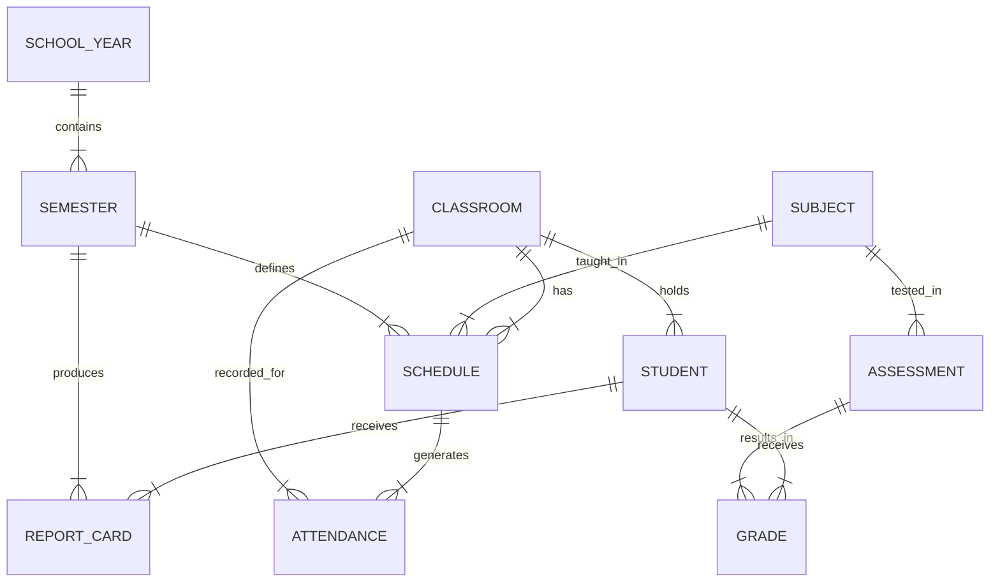

# Academic Domain Architecture

## 1. Audit Existing Module
- **Existing Files**: `src/pages/curriculum/CurriculumDashboard.tsx`, `src/pages/teacher/TeacherDashboard.tsx`, `src/pages/student/StudentDashboard.tsx`, `src/lib/scheduleGenerator.ts`
- **Current Data Strategy**:
  - `classes` exists as a collection but is also duplicated as a string array in `curriculum_data/master`.
  - `schedules` is a standalone collection mapping `teacherId` to `className` and `subject`.
  - `attendance_logs` tracks daily attendance per teacher-class-subject.
  - **Grades and Assessments** do not currently exist in the database! They are being handled purely as local state in `TeacherDashboard.tsx` and exported to CSV.
  - School Years and Semesters are not explicitly modeled; they are implicit.
- **Dependencies**: Tightly coupled with the Curriculum and Teacher UI.

## 2. ERD (Entity Relationship Diagram)

## 3. Firestore Schema
- **academic_semesters**: `year`, `type` (ganjil/genap), `isActive`
- **academic_subjects**: `code`, `name`, `type`, `createdAt`
- **classes (existing)**: `name`, `grade`, `homeroomTeacherId`, `students[]`
- **schedules (existing)**: `classId`/`className`, `subject`, `teacherId`, `dayIndex`, `periodIndex`, `startTime`, `endTime`
- **attendance_logs (existing)**: `teacherId`, `className`, `subject`, `tanggal`, `stats`, `students[]`
- **academic_assessments**: `className`, `subject`, `teacherId`, `title`, `type`, `date`
- **academic_grades**: `studentId`, `assessmentId`, `score`, `feedback`
- **academic_report_cards**: `studentId`, `semesterId`, `className`, `totalScore`, `averageScore`, `status`

## 4. Migration Strategy
- `migrateAcademicDomain()` creates baseline foundation records that did not previously exist (e.g. `academic_semesters`, `academic_subjects`).
- It parses `teachingLoads` from `curriculum_data/master` to dynamically extract and seed the `academic_subjects` collection.
- Existing `classes`, `schedules`, and `attendance_logs` are preserved to ensure zero data loss and backward compatibility with the current UI.

## 5. Kode
The domain logic is strictly isolated from UI in `src/domains/academic/`:
- `types.ts`: TypeScript interfaces for the 8 academic entities.
- `services.ts`: Firestore DAOs for fetching academic data.
- `migration.ts`: Migration and rollback scripts.

## 6. Testing
- Testing strategy focuses on data integrity through script execution.
- We run `migrateAcademicDomain()` to verify correct data extraction from `curriculum_data` to the new `academic_subjects` collection.

## 7. Rollback
- `rollbackAcademicDomain()` drops all newly generated documents (`academic_semesters`, `academic_subjects`, etc.).
- Original `classes`, `schedules`, and `attendance_logs` remain completely untouched.
- Ensures 100% backward compatibility and zero risk.
