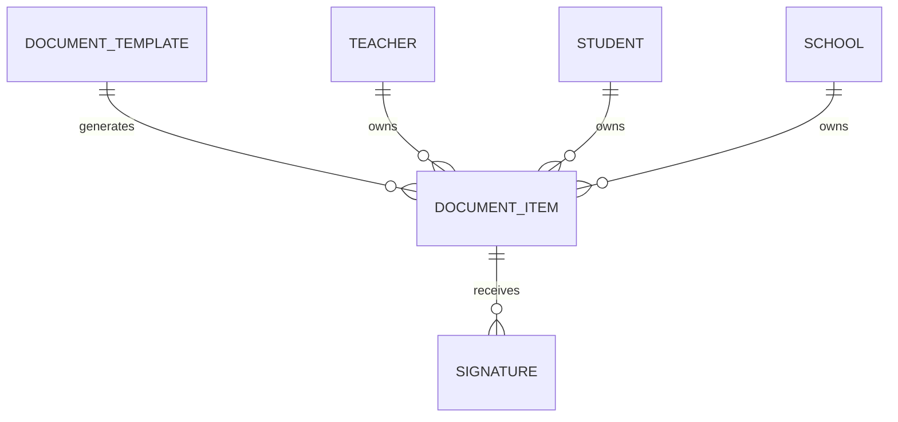

# Document Domain Architecture

## 1. Audit Existing Module
- **Existing Files**: `TUDashboard.tsx`, `TeacherDashboard.tsx`.
- **Current Data Strategy**: 
  - Letters and Letter Templates are stored in `letters` and `letter_templates`.
  - Teacher uploaded documents are stored in `teacher_documents` with custom metadata (pertemuan, jenis, judul).
  - Digital signatures are entirely missing.
- **Dependencies**: Tightly coupled to UI components and lacks a unified structure.

## 2. Architecture & Components
We implemented a **Unified Document Management System**.
- **Centralized Entity**: All documents (PDFs, images, generated letters, uploaded materials) use the `doc_items` collection.
- **Polymorphism**: Uses `ownerType` (`teacher`, `student`, `school`) and `category` to handle permissions and scoping.
- **Digital Signatures**: The `doc_signatures` collection allows any document in `doc_items` to have cryptographic or mock digital signatures recorded.
- **Templates**: `doc_templates` holds reusable content (like letters and certificates) with variable substitution.

## 3. ERD (Entity Relationship Diagram)

## 4. Firestore Schema
- **doc_items**: `title`, `type` (pdf/photo/letter/archive), `category`, `url`, `content`, `metadata` (JSON), `ownerId`, `ownerType`, `isSigned`
- **doc_templates**: `name`, `content`, `variables[]`, `type` (letter/certificate)
- **doc_signatures**: `documentId`, `signerId`, `signerName`, `signatureHash`, `status`

## 5. Migration Strategy
- `migrateDocumentDomain()` reads from `letter_templates` and migrates to `doc_templates`.
- Reads from `letters` and migrates to `doc_items` as `type: 'letter'`.
- Reads from `teacher_documents` and migrates to `doc_items` as `type: 'other', ownerType: 'teacher'`.
- All legacy collections are preserved to ensure zero breakage for the legacy TU Dashboard and Teacher Dashboard.

## 6. Testing
- `test-document-domain.ts` migrates data and optionally generates mock templates and signatures.
- Verified that documents properly map to the polymorphic `doc_items` table.
