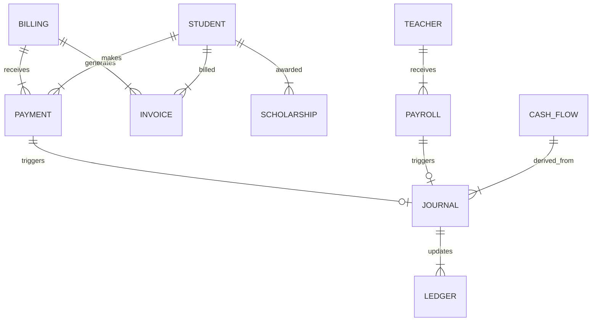

# Finance Domain Architecture

## 1. Audit Existing Module
- **Existing Files**: `LaporanTunggakanPanel.tsx`, `MasterTagihanPanel.tsx`, `PersetujuanPembayaranPanel.tsx`, `RiwayatPembayaranPanel.tsx`, `StudentDashboard.tsx`, `AdminDashboard.tsx`.
- **Current Data Strategy**: 
  - `billing_events`: Holds master data for billings (type, amount, target).
  - `payments`: Holds payment records from students (status, amount, proofUrl).
  - Other concepts like Ledger, Cash Flow, Payroll are missing.
- **Dependencies**: Directly coupled to UI components (Bendahara panels).

## 2. ERD (Entity Relationship Diagram)

## 3. Firestore Schema
- **finance_billings**: `type`, `title`, `amount`, `targetType`, `targetValue`, `dueDate`
- **finance_payments**: `billingId`, `studentId`, `amount`, `method`, `status`
- **finance_invoices**: `billingId`, `studentId`, `invoiceNumber`, `totalAmount`, `status`
- **finance_ledgers**: `accountId`, `accountName`, `type`, `balance`
- **finance_journals**: `transactionDate`, `description`, `entries[]`
- **finance_cash_flows**: `type`, `category`, `amount`, `date`
- **finance_scholarships**: `studentId`, `type`, `amount`, `status`
- **finance_payrolls**: `teacherId`, `periodMonth`, `netSalary`, `status`

## 4. Migration Strategy
- `migrateFinanceDomain()` reads `billing_events` and maps to `finance_billings`.
- Reads `payments` and maps to `finance_payments`.
- Initializes default Chart of Accounts into `finance_ledgers`.
- Original collections (`billing_events`, `payments`) are kept intact so that the Bendahara panels and Student dashboards continue working perfectly (Backward Compatible).

## 5. Kode
- The logic is decoupled into `src/domains/finance/`:
  - `types.ts` defines all 8 entities.
  - `services.ts` provides data access functions.
  - `migration.ts` has safe copy-only migration.

## 6. Testing
- Testing strategy focuses on data integrity through script execution.
- We run `migrateFinanceDomain()` to copy data over and initialize baseline Ledgers.

## 7. Rollback
- `rollbackFinanceDomain()` wipes all `finance_*` collections.
- Original `billing_events` and `payments` remain completely untouched, ensuring zero data loss and risk-free revert.
