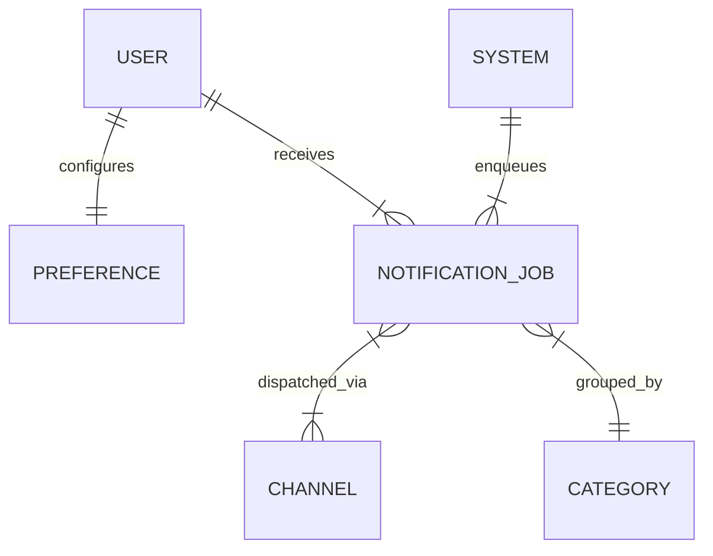

# Notification Domain Architecture

## 1. Audit Existing Module
- **Existing Files**: None, only early conceptual docs (`SchoolNotificationEngineArchitecture.md`).
- **Current Data Strategy**: No actual implementation of push notifications, email routing, or queues in the application logic. Business domains handled their own UI alerts or did not notify at all.
- **Dependencies**: Notifications touch every domain (Academic, Finance, Workflow) but must remain entirely decoupled.

## 2. Architecture & Components
We implemented an **Asynchronous Queue-Based Notification Center** that acts as a standalone service.
- **Queue Engine**: Notifications are never dispatched directly. Instead, `enqueueNotification()` adds them to `notification_jobs`. A worker (`queue.ts`) picks up pending jobs and dispatches them asynchronously.
- **Preference Engine**: Before dispatching, the engine consults `notification_preferences` to respect user Opt-Outs (e.g. muted Announcements) and Channel Priorities (e.g. Email over Push).
- **Multi-Channel Dispatcher**: Supports abstracting the dispatch sequence to `email`, `push`, `whatsapp`, and `in_app`.

## 3. ERD (Entity Relationship Diagram)

## 4. Firestore Schema
- **notification_jobs**: `userId`, `category` (academic/finance/etc), `channels[]`, `priority`, `payload` (title/body/actionUrl), `status` (pending/processing/sent/failed), `scheduledAt`
- **notification_preferences**: `userId`, `optOutCategories[]`, `preferredChannels[]`, `quietHoursStart`
- **notification_templates**: `name`, `category`, `subjectTemplate`, `bodyTemplate`, `whatsappTemplateId`

## 5. Queue Mechanism
- **Producer**: Any domain (e.g. Finance) calls `enqueueNotification()`.
- **Consumer**: `processNotificationQueue()` acts as the worker.
  - Fetches `status == 'pending'`
  - Loads User Preferences
  - Skips if opted-out
  - Attempts dispatch to target channels
  - Updates `status` to `sent` or `failed`

## 6. Kode
The implementation sits in `src/domains/notification/`:
- `types.ts`: Domain models for Notifications and Preferences.
- `services.ts`: Producer functions (`enqueueNotification`) and client queries (`getUserNotifications`, `updateUserPreference`).
- `queue.ts`: Consumer logic for the async processing pipeline.

## 7. Testing
- `test-notification-domain.ts` successfully models:
  1. Setting up user preferences (Opting out of 'announcement').
  2. Enqueueing an Academic alert, a Finance alert, and an Announcement alert.
  3. Processing the queue.
  4. Verifying that the Academic/Finance messages sent successfully, while the Announcement was explicitly skipped based on user preferences.
