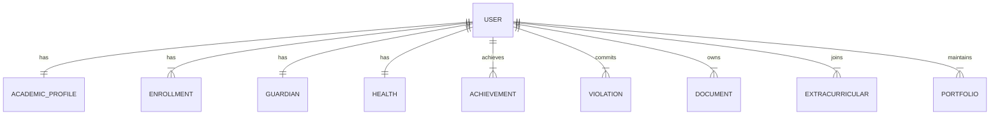

# Student Domain Architecture

## 1. Audit Existing Module
- **Existing Files**: `src/pages/student/StudentDashboard.tsx`, `AdminDashboard.tsx`, `CurriculumDashboard.tsx`, etc.
- **Current Data Strategy**: Student data is primarily stored within the general `users` collection as flat properties (e.g., `classId`, `nisn`, `waParentNumber`).
- **Dependencies**: Tightly coupled with UI components; missing a clear boundary between presentation and data logic.
- **Dashboard Features**: Handles profile editing, class scheduling (`schedules` collection), payment history (`payments` & `billing_events`), and attendance records (`attendance_logs`).

## 2. ERD (Entity Relationship Diagram)

*(User represents a record in the existing `users` collection where `role == 'student'`)*

## 3. Firestore Schema
- **users (existing)**: Minimal auth data (name, email, role).
- **student_academic_profiles**: `userId`, `nis`, `nisn`, `status` (active/graduated), `major`, `entryYear`, `updatedAt`
- **student_enrollments**: `userId`, `classId`, `academicYear`, `semester`, `enrolledAt`
- **student_guardians**: `userId`, `fatherName`, `motherName`, `guardianName`, `phones`, `jobs`, `addresses`, `updatedAt`
- **student_health**: `userId`, `bloodType`, `height`, `weight`, `allergies`, `medicalHistory`, `updatedAt`
- **student_achievements**: `userId`, `title`, `type`, `level`, `year`, `description`, `proofUrl`
- **student_violations**: `userId`, `date`, `type`, `points`, `description`, `status`
- **student_documents**: `userId`, `type` (kk/akta/ijazah), `url`, `verified`
- **student_extracurriculars**: `userId`, `activityId`, `role`, `joinDate`, `status`
- **student_portfolios**: `userId`, `title`, `description`, `link`, `mediaUrls`

## 4. Migration
- `migrateStudentDomain()` scans all `users` with `role == 'student'`.
- Extracts `nis`, `nisn` into `student_academic_profiles`.
- Extracts `classId` into `student_enrollments`.
- Extracts `fatherName`, `motherName`, `waParentNumber` into `student_guardians`.
- Initializes empty records for `student_health`.

## 5. Kode
The domain logic is strictly isolated from UI in `src/domains/student/`:
- `types.ts`: Contains TypeScript interfaces for all 9 entities.
- `services.ts`: Contains Firestore DAOs (`getAcademicProfile`, `upsertAcademicProfile`, etc.).
- `migration.ts`: Migration and rollback scripts.

## 6. Testing
- Testing strategy focuses on data integrity through script execution.
- We run the `migrateStudentDomain()` function to verify correct data propagation to new collections without destroying existing data.

## 7. Rollback
- `rollbackStudentDomain()` drops all newly generated documents across the 9 new collections without touching the original `users` collection.
- This ensures 100% backward compatibility and a zero-risk rollback path.
